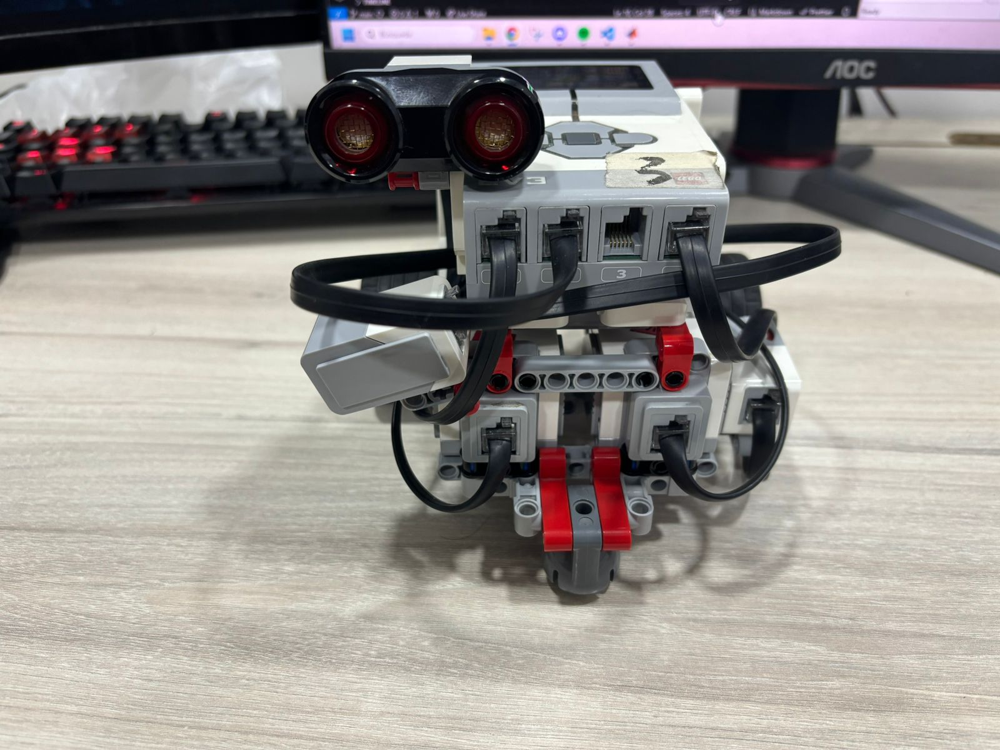
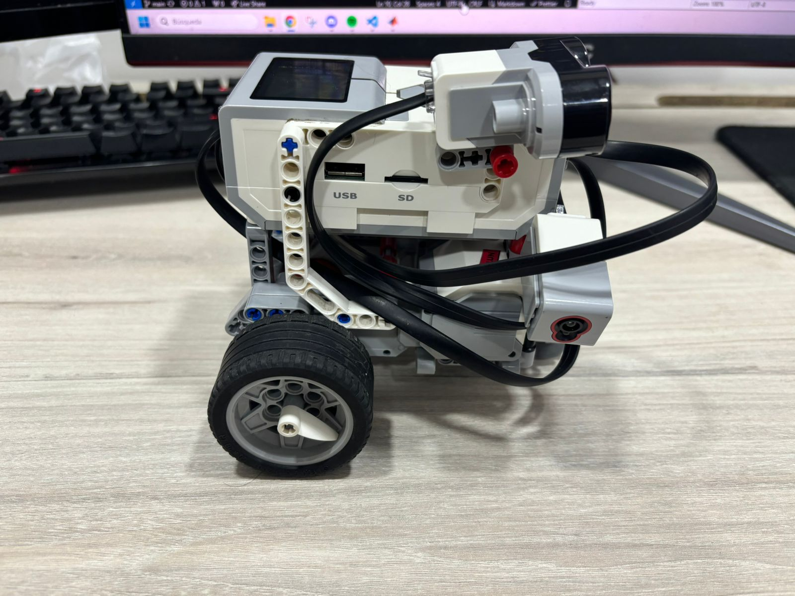
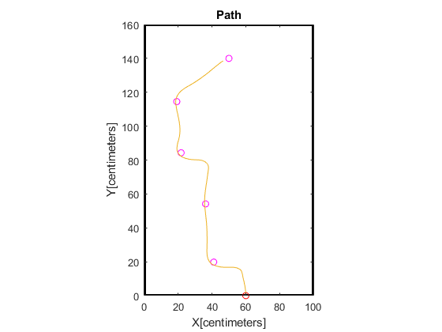

# Misión 1

Se utilizo un algoritmo Bug 0 para navegar de la posición 1 a la posición 2. El robot se dirige al objetivo hasta que encuentra un obstaculo, este se rodea hasta que se vuelva a tener una trayectoria clara al objetivo.

## Configuración

### Software
Para un uso más extensivo de las capacidades del EV3 y sus sensores, se utilizo la toolbox oficial de MATLAB. Además, en el EV3 se tiene disponibilidad de ultrasonido, sensor de color y giroscopio, por lo que la implementación de un algoritmo BUG se vuelve compleja utilizando lenguaje de bloques en LEGO MINDSTORM.

### Configuración del robot

El robot cuenta con 3 sensores, un ultrasonido ubicado en la parte superior del robot que apunta en dirección frontal para detectar obstaculos.



En el lateral derecho, se ubica un sensor de color configurado para la detección de intensidad de luz reflejada.



En la parte lateral izquierda se ubica un giroscopio para determinar el ángulo de rotación del robot

### Obstaculos
El montaje se realizó en una mesa de 160cm x 100cm, los obstaculos utilizados fueron libros de 24cm x 17 cm apilados hasta lograr una altura superior a la del robot. Los obstaculos se colocaron a una distancia de aproximadamente 35cm .

El punto de origen se ubicó en el borde lateral derecho a una distancia de 60cm aproximadamente.
 


## Algoritmo
### Inicialización
Para realizar el algoritmo, primero se declaran algunas constantes del robot como el radio de las ruedas, el tamaño de la trocha, los ticks de los encoders, y el modelo de cinemática inversa para tracción diferencial:

```Matlab
% Wheel radious
wheel_r = 5.5/2; %cm

% Distance from center to wheel
l = (14.5/2 - 2.85/2);

% Perimeter of wheel
c = 2*pi*wheel_r; %cm

% Map Size
width = 100; %cm
height = 160; %cm
resolution = 1;

% Encoders ticks
tpr = [360 360];

% Differential tracktion, inverse problem
diffControl = [1/wheel_r l/wheel_r; 1/wheel_r -l/wheel_r];
```

Posteriormente se realiza la conexión con el robot y se inicializan los sensores:

```Matlab
% Initialization
myev3 = legoev3('usb')
beep(myev3)

% Connect and reset motors
r_motor = motor(myev3,'B');
l_motor = motor(myev3,'C');

% Connect and reset gyro
gyro = gyroSensor(myev3, 4);
resetRotationAngle(gyro)

% Color sensor
color = colorSensor(myev3, 2);

% Ultrasound Sensor
us = sonicSensor(myev3, 1);
```

Dado los sensores disponibles en el EV3, se opta por realizar odometría. Para ello, se establece el punto de origen y de destino:

```Matlab
% Start and goal
startPoint = [60 0 pi/2];
goal = [50 140 pi/2];
position = startPoint;
```

Luego se reinician los sensores para tener un punto de referencia claro:


```Matlab
% Reset encoders
resetRotation(r_motor);
resetRotation(l_motor);

% Reset gyro
resetRotationAngle(gyro);
```


Se establecen constantes como el tiempo de muestreo, la distancia mínima para detectar un objeto con el ultrasonid y la velocidad lineal:


```Matlab
% Sampling Time
ts = 0.1;

% Distance to detect an object with ultrasound
distanceTreshold = 10 /100;

% Linear Speed
vel = 10;
```

Se calcula la distancia hasta el punto final y se crean variables que almacenan los datos de los sensores para ser graficados al finalizar la ejecución:

```Matlab
% Distance to te goal
distanceToGoal = norm(position(1:2) - goal(1:2));

% Sensor data for plotting
usData = [0];
colorData = [0];
gyroData = [0];

goals = goal;
```

Finalmente se coloca el estado inicial del algoritmo y se crea un bucle hasta la distancia hasta el punto final sea menor a 5cm. Al inicio de cada bucle se calcula el tiempo de ejecución:

```Matlab
% Initial State
state = 'go-to-goal';

% Bug 0
while distanceToGoal>5
% Time measurement
    tic
```

### Odometría

Al inicio de cada bucle se realizan los calculos para determinar la pose del robot, para ello se extrae la información de los sensores:

```Matlab
% Read Sensors
    % Get wheels rotation
    
    rotation_r = -readRotation(r_motor);
    rotation_l = -readRotation(l_motor);
    angleList(i+1,:) = [rotation_r rotation_l];
    
    % US distance
    measureUs = readDistance(us);
    usData(i+1) = measureUs;

    % Color intensity
    measureIntensity = readLightIntensity(color, 'reflected');
    colorData(i+1) = measureIntensity;

    % Giro 
    measureGyro = deg2rad(-double(readRotationAngle(gyro))) + startPoint(3);
    gyroData(i+1) = measureGyro;
```

Posteriormente, se mide la velocidad de las ruedas y se calcula la nueva posición, el ángulo del robot se extrae del giroscopio sumado al ángulo de la posición inicial:

```Matlab
    % Get Wheels speed
    dr = (angleList(i+1,1)-angleList(i,1))/tpr(1)*c;
    dl = (angleList(i+1,2)-angleList(i,2))/tpr(2)*c;
    dteta = measureGyro-position(i, 3);
    d = double((dr+dl)/2);

    % Compute current position
    p = position(i,:)' + [d*cos(position(i,3));d*sin(position(i,3)); dteta];    
```

### Bug 0

Dentro del algoritmo se establecen 4 estados:
* go-to-goal: El robot se dirige a la meta establecida.
* rotating: El robot encontro un obstaculo y esta rotando para colocarse paralelo a el.
* avoid-obstacle: El robot esta rodeando el obstaculo.
* repositioning: El robot ya no detecta el obstaculo en el lateral izquierdo y avanza una distancia para tener espacio de girar en dirección a la meta.

Dentro de cada estado se establece una acción de control definida como deltaPos = [velocida_lineal ; velocidad_angular] para el uso de la matríz de cinemática inversa de tracción diferencial.

A partir de ello, cada estado tiene el siguiente código:


#### go-to-goal
El algoritmo toma la medición del ultrasonido y la compara con la distancia mínima de detección de objeto en frente, en caso de que se detecte presencia de obstaculo, se pasa al estado 'rotating'. 

Si se detecta un obstaculo al costado izquierdo del robot, se entiendo que se esta rodeando un objeto, por lo que se pasa al estado 'avoid-obstacle'.

Si no se detectan obstaculos, el robot continúa hacia la meta. Para ello se usa la función directionControl, que recibe la pose actual y el punto de meta, esta función se explicará en secciones posteriores.

```Matlab
    % Bug 0 states
    switch state
        % No obstacles
        case 'go-to-goal'
            % Verify if US detects an object
            if measureUs <= distanceTreshold
                state = 'rotating';
            elseif measureIntensity > 0 
                state = 'avoid-obstacle';
            else
                % Else go to goal

                % Compute angle to goal
                omega = directionControl(p, goal);
                deltaPos = [vel;omega];
            end
```

#### rotating
En este estado, el robot gira sobre si mismo a una velocidad de 2 rad/s, hasta que el sensor lateral detecte el objeto, dando a entender que se encuentra en una posición aproximadamente paralela al objeto.

```Matlab
        case 'rotating'      
            deltaPos = [0;2];
            
            % No obstacles, go to goal
            if measureIntensity > 0 
                state = 'avoid-obstacle';
            end
```

#### avoid-obstacle
Este estado se encarga de seguir al objeto de forma aproximada, esto debido a que el sensor lateral detecta presencia pero no distancia.

En caso de que el sensor lateral si detecte al objeto, este mantiene una valocidad lineal sin velocidad angular.

Si la intencidad del sensor de luz es muy alta, quiere decir que el sensor esta a punto de chocar con el objeto, en ese caso, se realiza una breve desviación manteniendo una velocidad angular de 0.5 rad/s hasta que la intencidad disminuya.

Si el sensor de luz no detecta ningún objeto y el ultrasonido tampoco mide una distancia inferior a la mínima, quiere decir que el robot se alejó del obstaculo, para que el robot pueda continuar con su trayecto sin posibilidades de choques, el robot se aleja una distancia de aproximadamente 15cm en la dirección en la que se dirije, se cambia al estado 'repositioning':


```Matlab
        case 'avoid-obstacle'
            % Detect if obstacle is in front or on the rigth side
            % Robot will try to stay parallel to object
            if measureIntensity > 0
                % No obstacle in front but in rigth, keep going forward
                deltaPos = [vel;0];
            end
            
            if measureIntensity > 20
                % if sensor is to close to wall
                deltaPos = [vel;0.5];
            end

            % No obstacles, go to goal
            if measureIntensity == 0 && measureUs > distanceTreshold
                state = 'repositioning';      
                newP = [p(1)+14*cos(p(3)) p(2)+14*sin(p(3)) p(3)];
                goals = [goals; newP];
            end
```

#### repositioning

En este caso, el robot se dirige a una distancia de aproximadamente 15 cm desde el punto donde dejo de detectar al objeto en la dirección a la que apunta el robot. El estado se mantiene hasta que el robot cumple una distancia mínima al objetivo, cuando se cumple, vuelve al estado 'go-to-goal' para continuar al objetivo:

```Matlab
        case 'repositioning'
            % Detect if obstacle is in front or on the rigth side
            % Robot will try to stay parallel to object

             omega = directionControl(p, newP);
             deltaPos = [vel;omega];
            
            
            % No obstacles, go to goal
            if norm(position(i, 1:2) - newP(1:2)) < 5
                state = 'go-to-goal';
            end
```

### Cinematica 

Despues de establecer las acciones de control, se calculan las velocidades angulares de cada rueda:

```Matlab
% Compute new angular velocity for wheels
    newAngSpeed = diffControl * deltaPos;
```

Posteriormente se realiza el control sobre cada una de ellas con un control PI:

```Matlab
% PI Wheels speed controller
    [error_r, rotation_r, speed_r, integral_r] = speedController(newAngSpeed(1), angleList(i,1), speed_r, integral_r, r_motor, ts);
    [error_l, rotation_l, speed_l, integral_l] = speedController(newAngSpeed(2), angleList(i,2), speed_l, integral_l, l_motor, ts);
```

Luego se añade la pose actual al historico de poses para la reconstrucción del camino, tambien se recalcula la distancia hasta la meta:

```Matlab
    % Append position to list for plot
    position(i+1, :) = p';

    % Compute distance to goal
    distanceToGoal = norm(position(i, 1:2) - goal(1:2));
    
    i=i+1;
```

Finalmente se mide el tiempo de ejecución del algoritmo y se resta del tiempo de muestreo. En el tiempo restante se pausa la ejecución del programa:

```Matlab
    % Pause for sampling
    currentTime = toc;
    pause(ts-toc)
```

Cuando el robot llega a la meta, se detienen los motores:

```Matlab
% Stop motors when reach goal
stop(r_motor)  
stop(l_motor)
```


#### Control de velocidad de motores
La toolbox utilizada solo permite establecer la velocidad de los motores en terminos de porcentaje, además, este porcentaje no corresponde a una velocidad fija sino que varía dependiendo de la carga de la batería, material, etc, por ello fue necesario realizar un controlador P.

Dentro de la función de control, se establecen la constante kp, se miden las rotaciones actuales del encoder y las compara con las mediciones del tiempo anterior. 

```Matlab
% Wheel speed control
function [error, rotation, speed, integral] = speedController(rads, prevRotation, speed, integral, motor, ts)
    % PID constants
    kp = 10;
    ki = 10;

    % Read rad/s
    rotation = -readRotation(motor);   

    rads_current = deg2rad((double(rotation) - double(prevRotation))/ts);
```

Según el datasheet de los motores grandes del LEGO EV3, estos llegan hasta 170 rpm, realizando una regla de tres, se puede estimar el error en terminos de porcentaje de velocidad.

```Matlab
    % Compute error
    error = rads-rads_current;
    ErrorInSpeedP = error/rpmInrads;
```

Se calcula la nueva velocidad y se verifica que no sobrepase los limites del motor:

```Matlab
    % Compute Speed
    speed = speed+kp*ErrorInSpeedP;
        % Saturation
    if speed > 100
        speed = 100;
    end
    if speed < -100
        speed = -100;
    end
```

Luego se asigna la velocidad y se arranca el motor:

```Matlab
    % Set Speed
    motor.Speed = -speed;

    start(motor);
```

#### Control de dirección
El control de dirección se encarga de ajustar la posición angular del robot apuntando a un punto especifico. Para ello se calcula la dirección al objetivo y el error en radianes. Finalmente se asigna una nueva velocidad angular para colocar el robot mirando a la meta.

```Matlab
function omega = directionControl(currentPos, goal)
    %% Direction Control
    direction = (goal' - currentPos) / norm(goal' - currentPos);

    % Orientation to goal
    desiredOrientation = atan2(direction(2), direction(1));

    % Error in orientation to goal
    orientationError = desiredOrientation - currentPos(3);
    
    % Map error in [-pi, pi]
    orientationError = atan2(sin(orientationError), cos(orientationError));
    
    % Compute new angular speed to face to goal
    Kp = 2; % Proportional gain
    omega = Kp * orientationError;
end
```


## Resultados

El robot logra llegar a la meta realizando la siguiente trayectoria:



Cada punto representa uno de los puntos objetivos para el control de dirección, los que se encuentran intermedios al origen y final corresponden a la distancia de aproximadamente 15cm que se establecen en el estado 'repositioning' del algoritmo.