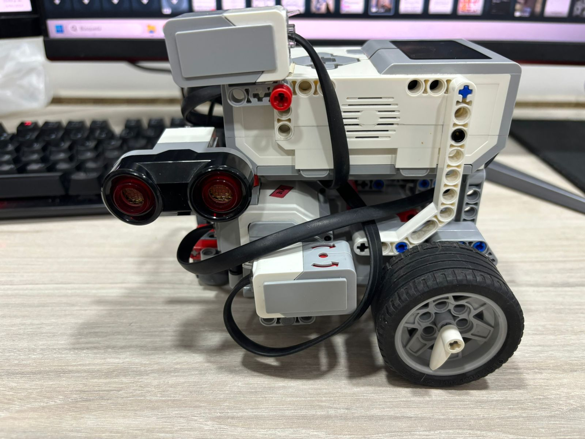

# Misión 2: Maze

Esta misión tiene como objetivo que el LEGO EV3 sea capaz de salir de un laberinto, empezando desde la entrada P1 hasta la salida P2. El laberinto a resolver es:

Para resolver el laberinto se utilizo el algoritmo Wall Following con el muro izquierdo, esto debido a su fácil implementación y la efectividad del algoritmo. El LEGO EV3 fue programado con su IDE oficial utilizando lenguaje de bloques.

## Robot
El robot utiliza 3 sensores para completar el algoritmo: ultrasonido para detectar la presencia o ausencia de muros a la izquierda, sensor de intensidad de luz en la parte frontal para detección de muros en frente del robot, y un giroscopio que permite controlar la rotación del robot.

El robot tiene una longitud de aproximadamente 17cm x 15cm, y el laberinto esta compuesto por libros que tienen un tamaño de 17cm x 24cm, de forma que las dimensiones del laberinto son lo suficientemente grandes como para que el robot pueda manobriar, el diagrama aproximado es el siguiente:

## Wall Following (Izquierdo)

Para empezar, se inicializan los motores de movimiento como el B y el C, se establece la velocidad de movimiento al -20% de la velocidad máxima, y se establece que los motores mantengan su posición al finalizar su desplazamiento, esto con el fin de que los movimientos tengan mayor presición.
Posteriormente se reinicia el ángulo del giroscopio, se calibra el sensor de color, y se establece el volumen de la bocina al 10% para reproducir un sonido al iniciar el algoritmo.
Posteriormente se inicializa una variables "distance" a 30cm, que corresponde a la distancia mínima para detectar un camino disponible al lado izquierdo por parte del ultrasonido.

Despues de inicializar el algoritmo, se introduce un bucle "forever", donde se manejan 3 condicionales:

### Giro a la derecha

En caso de que el sensor de color detecte una intencidad mayor a 0 (un objeto justo en frente) y el ultrasonido detecte una distancia menor a la distancia minima (un objeto cerca a la izquierda), implica que el único camino disponible es al costado derecho del robot. Cuando se detecta esta condición, el robot retrocede 20°, esto debido a que necesita apartarse ligeramente del muro frontal para poder realizar un giro a la derecha sin golpear el objeto. 
Posteriormente se reinicia el ángulo en el giroscopio, donde se aplica un delay de 1 segundo. Este delay se debe a que el reinicio del giroscopio se realiza de forma asincrona, por lo que con este delay se asegura que el sensor este reinciado para la comparación que se aplica más adelante.
A partir de esto, se realiza un giro a la derecha hasta que el giroscopio marque un valor superior a 80°, dando a entender que el robot completo el giro.

### Seguir recto
En caso de que el sensor de color no detecte intensidad (sin ningún objeto en frente) y el ultrasonido detecte un muro en el costado izquierdo, el LEGO EV3 mantiene la posición y continúa recto.

### Giro a la izquierda
El ultimo caso posible es que el sensor de ultrasonido detecte una distancia mayor a la distancia mínima establecida al inicio del algoritmo, esto significa que hay un camino disponible al costado izquierdo del robot.
Para realizar el giro, el robot avanza 1.2 rotaciones en dirección frontal, de forma que el robot avanza aproximadamente 20cm para tener espacio para girar a la izquierda. Luego se reinicia el giroscopio, se aplica un dealy de 1 segundo dado a la asincronia del reinicio del sensor, y luego se aplica el giro a la izquierda hasta que el giroscopio marque un valor menor a -80°, dando a entender al robot que completó el giro.
Luego el robot avanza 0.7 rotaciones (aproximadamente 15cm) con el fin de que el ultrasonido no mida la distancia del camino de donde venía, de forma que el robot no cae en un bucle de girar a la izquierda.

## Resultados

Una vez programado el algoritmo, se coloca en el laberinto real y se observa que es capaz de resolverlo satisfactoriamente.

<video width="320" height="240" controls>
  <source src="https://github.com/mobile-robotics-unal/lab3-navigation/assets/53503084/615e2bf7-3d6c-4814-a38a-0c553342edac" type="video/mp4">
</video>

Se observa que, a pesar de que se establece la comparación con el giroscopio a 80°, el robot tiende a girar un ángulo mayor, sin embargo, no supone un problema para la dimensiones del laberinto.

https://www.youtube.com/watch?v=dqVG9TifkD4&ab_channel=DanielEstebanMolanoGarz%C3%B3n
