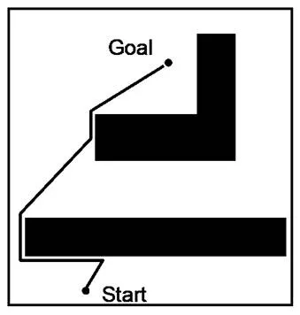
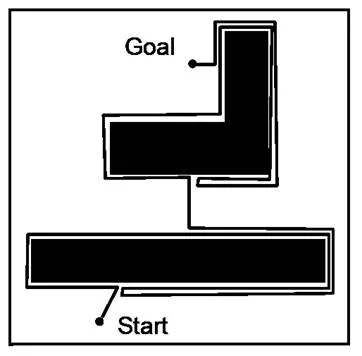
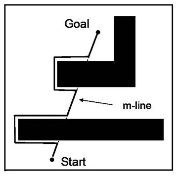

# Navegación

La navegación consiste en el proceso de lograr alcanzar un destino determinado. Existen diferentes aproximaciones, navegación planeada y la navegación basada en comportamientos son dos posibles caminos de lograrlo.

## Navegación Planeada

Este tipo de navegación aunque requiere una etapa de procesameinto previo, permite la generación de trayectorias más eficientes y óptimas. Se caracteriza por:

- Implica la creación de un plan de movimiento desde el punto de inicio hasta el destino **antes de que el robot comience a moverse**.
- Requiere que el robot tenga un conocimiento preciso de su posición y del entorno, utilizando técnicas de SLAM (Simultaneous Localization and Mapping) para construir y actualizar mapas.

## Navegación Basada en Comportamientos

Este tipo de navegación es más reactiva y la toma de decisiones respecto al comportamiento a efectuar se decide como respuesta a las características del entorno inmediato como es percibido a través de los sensores. Se caracteriza por:

- Ser una estrategias de baja complejidad y específicas, como evitar obstáculos, seguir paredes, y buscar metas. Cada comportamiento se activa en respuesta a ciertas condiciones del entorno.
- Gestión de comportamientos. Donde se selecciona en orden de entre los diferentes acciones simples que puede efectuar el robot.

La respuesta del robot es más reactiva y flexible, permitiendo adaptaciones rápidas a cambios inmediatos en el entorno. Sin embargo, puede resultar en trayectorias menos óptimas y más erráticas.

# Investigaciones Destacadas

Rodney Brooks y Mark Tilden son dos figuras destacadas en el campo de la robótica, cada uno con contribuciones significativas y enfoques únicos. A continuación, se detallan algunas de sus areas de interés, aportes y robots desarrollados por cada uno de ellos.

- **Rodney Brooks**, es un investigador en robótica fue director laboratorio de inteligencia artificial del MIT. Es conocido por su trabajo en robótica móvil y robótica cognitiva.

  - Genghis: robot hexápodo (seis patas) diseñado en el MIT en los años 80 que utiliza la arquitectura de subsunción.

  - Roomba: robot aspirador autónomo comercializado por iRobot, uno de los robots más difundidos.

- **Mark Tilden**, es un físico canadiense, conocido por su filosofía de diseño BEAM (biology, electronics, aesthetics and mechanics) con la cual se inspirado en sistemas biológicos y circuitos análogos.
  - robosapines: robots humanoides de juguete.

# Planeación de Rutas con Obstaculos

## Algoritmo A\* (A-Star)

El algoritmo A\* es un algoritmo de búsqueda de rutas que se utiliza comúnmente para encontrar caminos óptimos en un espacio de búsqueda. Utiliza una función de evaluación \( f(n) = g(n) + h(n) \) para seleccionar los nodos que expandirá, donde:

- \( g(n) \) es el costo del camino desde el nodo inicial hasta el nodo \( n \).
- \( h(n) \) es una heurística que estima el costo desde el nodo \( n \) hasta el objetivo.

### Características

- **Óptimo y Completo**: A\* es óptimo y completo cuando la heurística es admisible (es decir, nunca sobreestima el costo real).

- **Heurística Admisible**: Utiliza una función heurística para dirigir la búsqueda, lo que hace que sea más eficiente que la búsqueda por amplitud.
- **Espacio de Búsqueda**: Es adecuado para espacios de búsqueda discretos y bien definidos, como grafos y mapas de celdas.

## Algoritmo de RRT (Rapidly-exploring Random Tree)

El algoritmo RRT es un método de planificación de movimientos que se usa para explorar rápidamente espacios de alta dimensión. Crea un árbol que se extiende aleatoriamente desde un punto inicial hasta que encuentra un camino al objetivo.

### Caracteristicas

- **Exploración Aleatoria**: Extiende el árbol mediante la adición de nodos generados de forma aleatoria y conectados al nodo más cercano del árbol actual.

- **Alta Dimensionalidad**: Es eficiente para explorar espacios con muchos grados de libertad.
- **Convergencia**: Es probabilísticamente completo, lo que significa que encuentra una solución si se le da suficiente tiempo.

## Algoritmo PRM (Probabilistic Roadmap)

El algoritmo PRM es una técnica de planificación de rutas que se basa en la construcción de un grafo probabilístico en el espacio de configuración del robot. Se generan nodos aleatorios en el espacio libre y se conectan mediante trayectorias libres de colisiones.

### Fases del Algoritmo

1. **Fase de Construcción**:
   - **Muestreo**: Generación de nodos aleatorios en el espacio libre.
   - **Conexión**: Conexión de nodos cercanos mediante trayectorias locales, creando un grafo (roadmap).
2. **Fase de Consulta**:
   - **Inserción de Nodos de Inicio y Objetivo**: Los nodos de inicio y objetivo se insertan en el roadmap.
   - **Búsqueda de Camino**: Uso de algoritmos de búsqueda como Dijkstra o A\* para encontrar un camino en el grafo.

### Características

- **Exploración Probabilística**: Utiliza una muestra aleatoria para explorar el espacio de configuración.

- **Reutilización del Roadmap**: El grafo construido puede reutilizarse para múltiples consultas en entornos estáticos.
- **Alta Dimensionalidad**: Eficiente en la planificación de movimientos en espacios de alta dimensión.

### Comparación de los Algoritmos

| Algoritmo | Ventajas                                                                    | Desventajas                                                                 |
| --------- | --------------------------------------------------------------------------- | --------------------------------------------------------------------------- |
| **A\***   | - Óptimo y completo - Eficiente con heurística adecuada                  | - Costoso en tiempo y memoria para grandes espacios de búsqueda             |
| **RRT**   | - Eficiente en espacios de alta dimensión - Probabilísticamente completo | - Trayectorias subóptimas - No garantiza trayectorias optimas                     |
| **PRM**   | - Eficiente en espacios de alta dimensión - Reutilización de roadmap     | - Dependiente de la densidad de muestras - Costoso en entornos dinámicos |

Estos tres algoritmos son fundamentales en la planificación de rutas para robots en espacios con obstáculos, cada uno con sus fortalezas y debilidades, adecuados para diferentes tipos de problemas y entornos.

# Algoritmos Bug

Los algoritmos Bug estan basados en sensores, que pueden ser a distancia o de contacto para la detección de obstaculos, junto con odometría es posible conocer su posición actual en el plano.

El movimiento en los algoritmos Bug se basan en dos principios, moverse en linea recta o seguir los bordes de algun objeto, donde el robot cambia entre uno y otro dependiendo de la información de los sensores.

Estos algoritmos garantizan que el robot llega a la meta si se cumplen las siguientes condiciones:

- El robot se modela como un punto.
- Los obstaculos tienen perimetros con bordes finitos.
- El robot conoce su posición, orientación y puede medir la distancia recorrida.
- El robot puede calcular la distancia a la meta entre dos puntos con un uso de memoria pequeño.

## Bug 0

En el algoritmo Bug 0, el robot inicia en dirección a la meta establecida. Al encontrarse con un obstaculo lo sigue hasta que el obstaculo no este entre el robot y la meta.
El algoritmo finaliza cuando la meta es alcanzada.

## Bug 1

En bug 1, el robot se dirige a la meta hasta que encuentra un obstaculo. Cuando choca contra un obstaculo, este lo rodea hasta encontrar el punto más cercano a la meta. El robot debe memorizar cual es el punto más cercano a la meta sobre el contorno del obstaculo.

## Bug 2

En Bug 2 el robot se dirige hacia la meta hasta que encuentra un obstaculo. Para enfrentarlo, rodea el obstacula hasta que vuelve a estar sobre la recta entre el inicio y la meta.

# Algoritmos MAZE

Los algoritmos MAZE tienen como obejtivo superar obstaculos de tipo laberinto, es decir, navegar en espacios con muros paralelos hasta llegar a la salida.
A continuación se presentan 3 de los algoritmos usados para este tipo de navegación:

## Right-then-Left

- El robot se avanza hasta encontrar un obstaculo.
- El robot mira la distancia a la derecha.
- El robot mira la distancia a la izquierda.
- Si la distancia a la derecha es mayor, el robot gira en ese sentido. Si la distancia a la izquierda es mayor, entonces gira a la izquierda. Si ambas distancias son iguales, entonces gira a la izquierda.
- El algoritmo se repite hasta llegar a la meta.

## Left-then-Right

- El robot se avanza hasta encontrar un obstaculo.
- El robot mira la distancia a la derecha.
- El robot mira la distancia a la izquierda.
- Si la distancia a la izquierda es mayor, el robot gira en ese sentido. Si la distancia a la derecha es mayor, entonces gira a la derecha. Si ambas distancias son iguales, entonces gira a la derecha.
- El algoritmo se repite hasta llegar a la meta.

## Wall Following

- El robot avanza haciendo pequeños ajustes para mantenerse paralelo a los bordes laterales.
- Si el robot encuentra un obstaculo, debe girar a la izquierda en caso de que este siguendo el muro derecho, o a la derecha si sigue el muro izquierdo.
- Si no encuentra un muro, el robot debe girar a la derecha (en caso de seguir muro derecho), o a la izquierda (en caso de seguir el muro izquierdo).
- El algoritmo se repite hasta llegar a la meta.

## Referencias

1. [Biografia de Rodney Brooks. Laboratorio csail mit](https://people.csail.mit.edu/brooks/)
2. [The Evolution Of A Roboticist - Mark Tilden](https://web.archive.org/web/20110203060006/http://find.botmag.com/121084)
